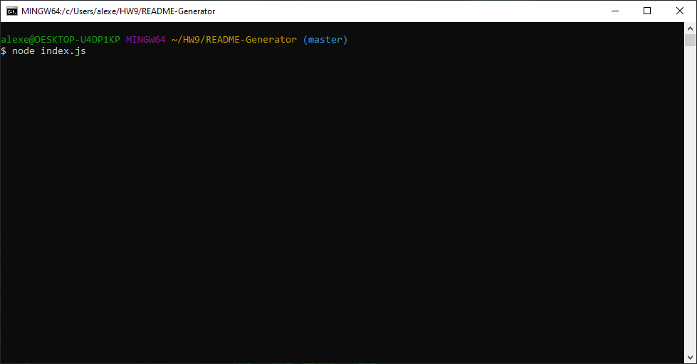
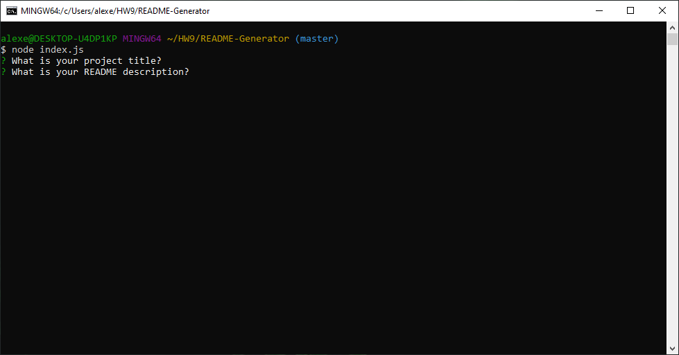

# Table of Contents
- [Title](#Title)
- [Description](##Description)
- [Installation](##Installation)
- [Usage](##Usage)
- [License](##License)
- [Contributing](##Contributing)
- [Tests](##Tests)
- [Questions](##Questions)

# Title
Custom README.md Generator
## Description
This generator will create a customized, organized, complete README file for your repository.
## Usage
Run the "node index.js" command to receive prompts for user input.
 

  

  
<iframe src="https://drive.google.com/file/d/1GCF4JPOFVLexQl25vAQrj9gSdYEma3Oh/preview" width="640" height="480"></iframe>
## License
This project is licensed under the ISC License.
## Installation Instructions
You must have npm/node modules installed.
## Contributing

## Tests

## Questions

[Visit my repository!](https://www.github.com/alexemrob)

For any further questions email me at AlexEmRob@gmail.com
